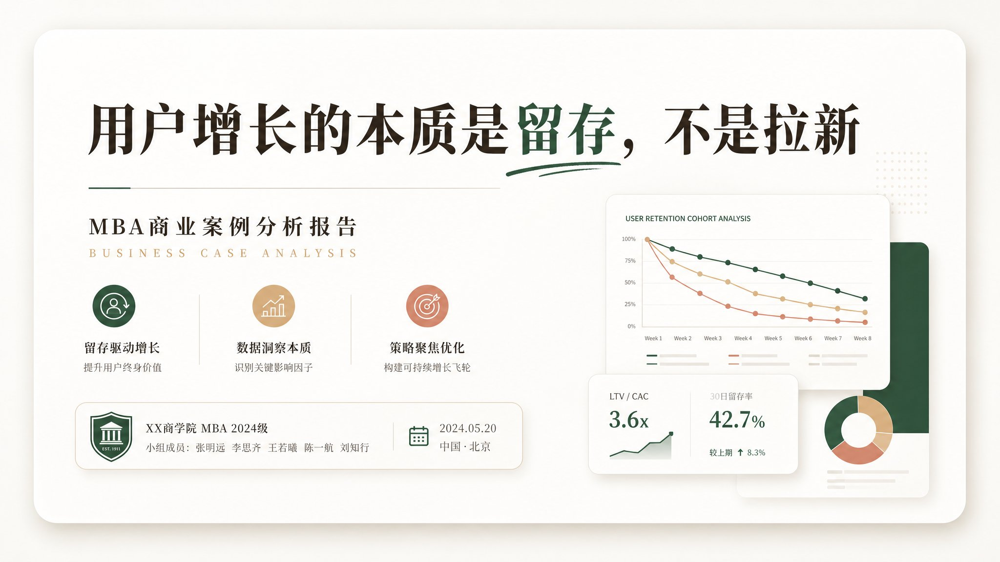
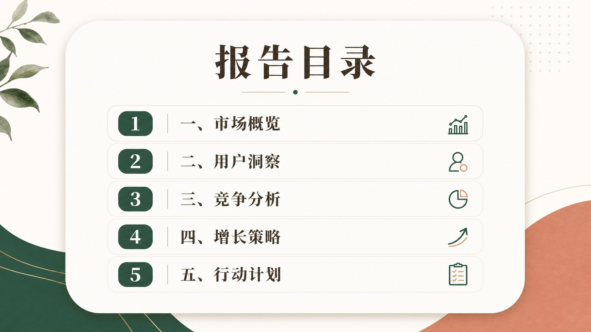
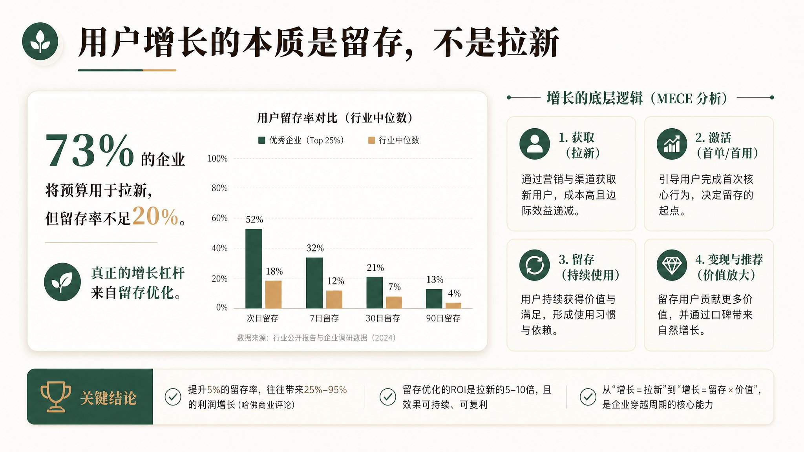

# image-ppt-workflow 🦞

AI PPT 生成技能——基于 grsai API（gpt-image-2-vip）直接生成整页幻灯片图片，合成 PPTX，自动写入中文演讲稿备注。**自带生图脚本，零外部依赖。**

## 快速开始

### 1. 获取 API Key

本技能通过 grsai 平台调用 gpt-image-2-vip / nano-banana-2 等模型生图。

1. 打开 https://grsai.ai/zh/dashboard/api-keys
2. 注册/登录账号
3. 在「API Keys」页面创建一个新的 API Key
4. 复制 Key 并设置到环境变量：

```bash
export GRSAI_API_KEY="***"
```

推荐写入 `~/.bashrc` 或 OpenClaw 的 `openclaw.json` 环境变量配置中。

### 2. 依赖

- `curl` — API 调用
- `jq` — JSON 解析
- `python3` + `python-pptx` + `Pillow` — PPTX 合成

### 3. 使用

```bash
# 生图
scripts/generate.sh \
  --model gpt-image-2-vip \
  --prompt "A PPT slide in Chinese traditional style..." \
  --ratio 2048x1152 \
  --output slides/ \
  --output-file "01-slide-cover.png"

# 基于参考图编辑
IMG_B64=$(base64 -w0 original.png)
scripts/generate.sh \
  --model gpt-image-2-vip \
  --prompt "Edit this slide: ..." \
  --ratio 2048x1152 \
  --image "data:image/png;base64,$IMG_B64" \
  --output slides/ \
  --output-file "02-slide-toc.png"

# 合成 PPTX
python3 scripts/merge_to_pptx.py \
  --slides slides/ \
  --notes speaker-notes.md \
  --output output.pptx
```

## 脚本说明

| 脚本 | 用途 |
|------|------|
| `scripts/generate.sh` | 调用 grsai API 生图，支持参考图编辑 |
| `scripts/merge_to_pptx.py` | 幻灯片图片 + 演讲备注 → PPTX |
| `scripts/overlay_text.py` | 文字叠加工具（仅需时使用） |
| `scripts/import-template-from-image.sh` | 从截图导入新模板 |

## 工作流程

详见 [SKILL.md](./SKILL.md) 的 10 步工作流：

1. 输入资料 → 2. 内容分析 → 3. 方案确认 → 4. 生成大纲 → 5. 审核大纲
→ 6. 生成每页 Prompt → 7. 生图 → 8. 生成备注 → 9. 合成 PPTX → 10. 迭代

## 分辨率规范

PPT 幻灯片默认 **2K 16:9（2048×1152）**，通过 `--ratio 2048x1152` 指定。
支持 1K / 2K / 4K，根据 `--quality` 参数选择。

## 模板清单

内置 14 套风格模板，覆盖主流汇报场景：

### 01 东方美学 · 纸感极简
文化/学术/品牌故事


### 02 手绘漫画 · 趣味叙事
产品教学/用户指南/科普


### 03 埃森哲 · 商务极简
商业汇报/咨询方案/投资路演


### 04 科技数据 · 未来感
技术产品发布/AI主题


### 05 生活方式 · 温暖治愈
消费品/美妆护肤/生活方式


### 06 杂志排版 · 编辑设计
时尚品牌/设计作品集/年度品牌报告


### 07 学术答辩 · 规范严谨
毕业论文答辩/学术汇报


### 08 国潮插画 · 新中式
文旅推广/非遗品牌/文化IP


### 09 数据报告 · 麦肯锡风
战略咨询/行业研究/尽调报告


### 10 现代企业 · 数据驱动
商业汇报/战略规划/数据分析


### 11 咨询级 · 红蓝商业风
战略规划/咨询报告/投资路演


### 12 企业项目管理 · 红蓝专业
项目汇报/进度跟踪/季度总结


### 13 企业架构 · 深蓝专业
系统架构/组织管理/流程图


### 14 温暖数据报告 · 生活洞察
MBA课堂汇报/商业案例分析





## 模型选择

| 优先级 | 模型 | 中文渲染 |
|--------|------|---------|
| 首选 | `gpt-image-2-vip` | ✅ 最佳 |
| 备选 | `nano-banana-2` | ✅ 良好 |
| ❌ 避免 | `gpt-image-2`（非 vip） | 中文易乱码 |
